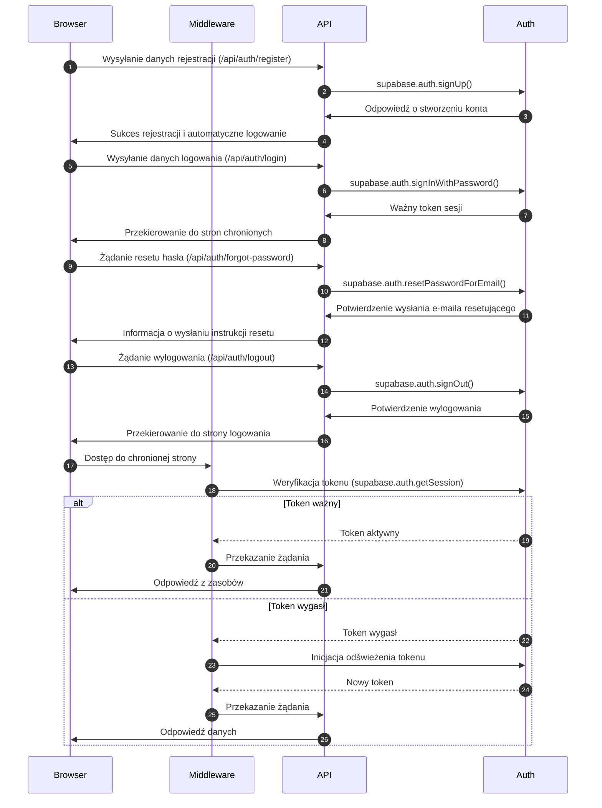

```mermaid
sequenceDiagram
    autonumber
    participant Browser
    participant Middleware
    participant API
    participant Auth

    %% Rejestracja
    Browser->>API: Wysyłanie danych rejestracji (/api/auth/register)
    API->>Auth: supabase.auth.signUp()
    Auth->>API: Odpowiedź o stworzeniu konta
    API->>Browser: Sukces rejestracji i automatyczne logowanie

    %% Logowanie
    Browser->>API: Wysyłanie danych logowania (/api/auth/login)
    API->>Auth: supabase.auth.signInWithPassword()
    Auth->>API: Ważny token sesji
    API->>Browser: Przekierowanie do stron chronionych

    %% Odzyskiwanie hasła
    Browser->>API: Żądanie resetu hasła (/api/auth/forgot-password)
    API->>Auth: supabase.auth.resetPasswordForEmail()
    Auth->>API: Potwierdzenie wysłania e-maila resetującego
    API->>Browser: Informacja o wysłaniu instrukcji resetu

    %% Wylogowywanie
    Browser->>API: Żądanie wylogowania (/api/auth/logout)
    API->>Auth: supabase.auth.signOut()
    Auth->>API: Potwierdzenie wylogowania
    API->>Browser: Przekierowanie do strony logowania

    %% Weryfikacja tokenu i odświeżanie
    Browser->>Middleware: Dostęp do chronionej strony
    Middleware->>Auth: Weryfikacja tokenu (supabase.auth.getSession)
    alt Token ważny
        Auth-->>Middleware: Token aktywny
        Middleware->>API: Przekazanie żądania
        API->>Browser: Odpowiedź z zasobów
    else Token wygasł
        Auth-->>Middleware: Token wygasł
        Middleware->>Auth: Inicjacja odświeżenia tokenu
        Auth-->>Middleware: Nowy token
        Middleware->>API: Przekazanie żądania
        API->>Browser: Odpowiedź danych
    end
```