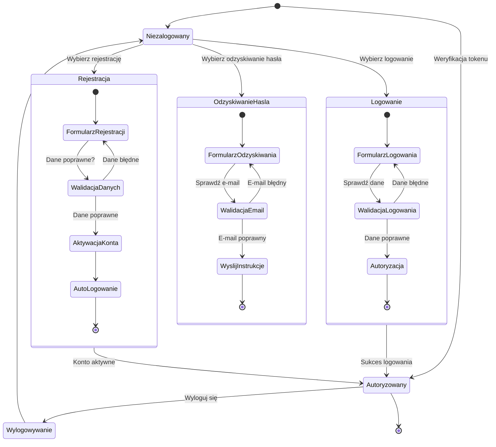

```mermaid
stateDiagram-v2
    [*] --> Niezalogowany

    Niezalogowany --> Logowanie: Wybierz logowanie
    Niezalogowany --> Rejestracja: Wybierz rejestrację
    Niezalogowany --> OdzyskiwanieHasla: Wybierz odzyskiwanie hasła

    state Rejestracja {
      [*] --> FormularzRejestracji
      FormularzRejestracji --> WalidacjaDanych: Dane poprawne?
      WalidacjaDanych --> AktywacjaKonta: Dane poprawne
      WalidacjaDanych --> FormularzRejestracji: Dane błędne
      AktywacjaKonta --> AutoLogowanie
      AutoLogowanie --> [*]
    }
    
    state Logowanie {
      [*] --> FormularzLogowania
      FormularzLogowania --> WalidacjaLogowania: Sprawdź dane
      WalidacjaLogowania --> Autoryzacja: Dane poprawne
      WalidacjaLogowania --> FormularzLogowania: Dane błędne
      Autoryzacja --> [*]
    }
    
    state OdzyskiwanieHasla {
      [*] --> FormularzOdzyskiwania
      FormularzOdzyskiwania --> WalidacjaEmail: Sprawdź e-mail
      WalidacjaEmail --> WyslijInstrukcje: E-mail poprawny
      WalidacjaEmail --> FormularzOdzyskiwania: E-mail błędny
      WyslijInstrukcje --> [*]
    }
    
    Logowanie --> Autoryzowany: Sukces logowania
    Rejestracja --> Autoryzowany: Konto aktywne
    Autoryzowany --> Wylogowywanie: Wyloguj się
    Wylogowywanie --> Niezalogowany
    Autoryzowany --> [*]

    %% Weryfikacja tokenu przy starcie aplikacji
    [*] --> Autoryzowany: Weryfikacja tokenu
```